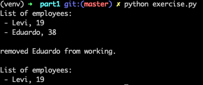

# Installation guide

## Part 1

After cloning this repository to try out part 1 of the exercise all you have to do is:

```
$ cd part1
# depending on your env you might have to use python3 here
$ python exercise.py

>>> you should now see the expected results...
```

## Part 2

For part 2 however it's recommended to use a virtual environment, I used virtualenv.

```
# make sure you're at the root of the project
$ ls
>>> part1            part2            requirements.txt
$ virtualenv venv # create a virtual environment
>>> created virtual environment output...
$ source venv/bin/activate # activate environment
(venv) $ pip install -r requirements.txt # install packages
>>> Collecting aniso8601==8.0.0
  Using cached aniso8601-8.0.0-py2.py3-none-any.whl (43 kB)
Collecting click==7.1.2
...

(venv) $ cd part2
(venv) $ python app.py
>>> * Serving Flask app "app" (lazy loading) ...
```

the server should now be running on http://0.0.0.0:4996/

# Part 1

The code for this part can be found in the part1 directory. The person and office class can be found in their respective files. And the exercises we were expected to do with those classes can be found in the exercise.py file. Running exercise.py should give you the output shown on the screenshow below (I wrote an extra 'print_employee' function to make the output more readable, which can again be found in exercise.py)



# Part 2

For this part of the test I had initially planned on using Django, since it comes with a lot more features than flask out of the box. Especially using packages like 'django Rest framework', building an RESTful api becomes a lot easier and more production ready.

But we were specifically tasked to use the classes we wrote in Part 1. Which made using traditions models to generate endpoints with the django rest framework a bit more challenging.
So I eventually decided to use Flask since it offers a lot of freedom. I still had to modify the classes a little to turn them in to models and make them work with a database.

All the code for this part of the assignment can be found in the part2 directory.

# Questions

- What has been the more difficult part?

Figuring out what exactly was expected of us for the second part of the exercise, and seeing how I can make the endpoints that I was writing to interact with the classes as REST as possible.

- What part of the system could be improved?

I would've liked to add proper error handeling through try/except blocks, I wasn't able to get to it for this exercise, but I think proper error handeling is very important for an API.

- How would you scale it, to be able to handle 1K calls per sec? and to handle 1M?

I would firstly improve the database structure, and make better use of the relational nature of the database. To reduce on the amount of queries I'd have to make in future to connect parts of the data. For a better development experience I would also prefer to step away from flask and move over to django/djangorestframework. This to generate a more traditional rest api based on models. Rather than using the classes we had to write for part 1.

But when we're talking scaling purely in performance I believe how you query and structure your database is usually where you can make the most improvements.

- How would you automate the testing?

I would look for a populair testing framework that fits my tools and my project (something like Robot framework in this case), and make sure to take a more TDD approach during development. For automated testing to also actually make sense.

- How would you implement a continuous development system (pipelines) for this particular case?

This heavily depends on the client/product-owner but ideally frequent meetings with the client, automated testing, actively taking feedback and keeping good communication within the team of developers making sure none of our builds collide -- or making sure we catch it in time -- and we're all on the same page.
